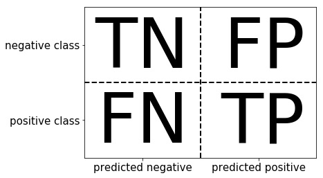

# 評価基準とスコア
ここまででは、accuracy と R^2 決定係数でモデルを評価してきたが、実際はそれでは不十分な事も多々あるので、紹介するね。
## そもそも、ビジネス上、現実味のある評価基準にであるかどうか、考えよう
決定係数で判断する事が、案件のビジネス上で意義のある判断指標なのかどうか、まっさらな目で一回くらい考えて置くほうがよいよ。
## 色々な評価基準について
### 2クラス分類器
#### 適合率 (precision)、再現率 (recall)、f-値 (f-measure)
クラス分類器の精度指標としては、accuracy 以外に上述のような3つのものが主によく使われる。定義を解説していくね。
##### 定義解説の前に
たとえば、とても偏ったデータ(10%が True、90%が False)のデータを元に予測モデルを作った場合、どんなデータを食わされても「False!」って返すテキトーモデルですら、accuracy が 90%に行くのは容易に予想がつく。
つまり、データの偏ってると、accuracy でのモデル判定では、「当てずっぽうモデル」と「本当に良いモデル」を見分ける事が__できない！！__
これは、そもそもaccuracyが、「全体のうち、予測が当たった数」の割合を見ている事に原因がある。 __どんな外れ方をしたのかに着目していないので、当てずっぽうさんが大変な間違い方をしているのに気づけない事が原因__。
そこで、「当たり」と判定したけど外れた数がどれくらいあったのかもちゃんと見ておく必要あるので、最初にそこから理解していく。
##### 偽陽性・偽陰性

2クラス分類器では、予測結果と現実結果の場合分けは上記のような4つの組み合わせがある。前述の説明で出てきた当てずっぽうさんをこの4つのグループに分けると、以下のような結果になったりする。
```
Most frequent class:
[[403   0]
 [ 47   0]]
```
上記の結果は、画像と同じようなグループ分けを、ネスト配列で再現している。  
この結果を見れば以下のような事に気づける。
- そもそも、positive って予想したものがゼロって、おかしくない？
- とりあえず全部「negative」って予想してるだけでしょこれ？

##### 改めて accuracy の定義を確認

$$
\begin{equation}
\text{Accuracy} = \frac{\text{TP} + \text{TN}}{\text{TP} + \text{TN} + \text{FP} + \text{FN}}
\end{equation}
$$

FP, FN の値両方が分母として加算されている。そのため、FP、またはFNのどちらかに大きな偏りがあったとしても、accuracy 単体では気づけ無いのだ！

##### 適合率 (precision) ＝ 予想をベース(母数)とした、的中率。
「陽性と予測」したサンプルのうち、「本当に陽性」だった割合。  

$$
\begin{equation}
\text{Precision} = \frac{\text{TP}}{\text{TP} + \text{FP}}
\end{equation}
$$
薬の臨床試験データから薬の効果があるかないかを判定する分類器の場合、「薬の効果があった＝陽性」とした場合、この指標での評価が重要。  
なぜなら、「実際薬の効果はなかったのに、あると判定する数＝偽陽性」が多いと、役に立たない薬も「役に立つ」と判定しかねないから。

##### 再現率 (recall) ＝ ファクトをベース(母数)とした、的中率。
「本当に陽性」だったもののうち、「陽性と予測」した割合。
$$
\begin{equation}
\text{Recall} = \frac{\text{TP}}{\text{TP} + \text{FN}}
\end{equation}
$$
癌を組織画像から判定する分類器の場合、「ガンである＝陽性」とした場合、この指標が重要。  
なぜなら、「本当はガンなのに、ガンじゃないと判定＝偽陰性」する事は、治療で助かる命をみすみす見逃すことになるから。(ガンじゃないけどガンと判定するのは、その後の精密検査で「ガンじゃありませんでした」→よかったー！ で終われるから、ビジネス上そこまでシビアに見なくて良い)

##### f-値 (f-measure)
適合率と再現率の調和平均。  
$$
\begin{equation}
\text{F} = 2 \cdot \frac{\text{precision} \cdot \text{recall}}{\text{precision} + \text{recall}}
\end{equation}
$$
直感ではこの数字の意味がわかりづらいが、実際計算させると、当てずっぽうさんと、ホントのモデルとの違いが数字で出てくる。
```
>>> ソース
from sklearn.metrics import f1_score
print("f1 score most frequent: {:.2f}".format(
    f1_score(y_test, pred_most_frequent)))
print("f1 score dummy: {:.2f}".format(f1_score(y_test, pred_dummy)))
print("f1 score tree: {:.2f}".format(f1_score(y_test, pred_tree)))
print("f1 score logistic regression: {:.2f}".format(
    f1_score(y_test, pred_logreg)))
```

```
>>> 出力
f1 score most frequent: 0.00 # 訓練データ内の最も多い答えをオウム返しするモデル
f1 score dummy: 0.13 # DummyClassifierクラスでテキトーに返すモデル
f1 score tree: 0.55 # 決定木モデル
f1 score logistic regression: 0.89 # ロジスティック回帰
```

#### 2クラス分類に関わる全評価指標を、一気に確認するやつ
classification_report関数がやってくれる！
##### 当てずっぽうモデルで確認してみる
```
>>> ソース
from sklearn.metrics import classification_report
print(classification_report(y_test, pred_most_frequent,
                            target_names=["not nine", "nine"]))
```
```
>>> 出力
precision    recall  f1-score   support

not nine       0.90      1.00      0.94       403
nine       0.00      0.00      0.00        47

avg / total       0.80      0.90      0.85       450
```

not nine 行 ＝ 「9以外」と判定＝陽性 と見た場合の各指標  
nine 行 = 「9」と判定＝陽性 と見た場合の各指標  
avg / total 行 ＝ 「not nine」「nine」の重み付けした平均値  

「9」と判定＝陽性 とした場合でいえば、全ての値でゼロとなっているので、このモデルはおかしい、と判断できる。  
しかし、「9じゃない」と判定＝陽性 とした場合、いずれもそれらしい値が出ている。(recall が1はちょっと怪しいけど)  
ここで大事な知見としては、__「何に着目して(何を positive として)いるかで、評価指標は大きく変わることもある」__

> 評価指標を見る際は、positive としている事以外の方の指標も確認したほうが良いぞ！  

##### ロジスティック回帰モデルでの結果も見てみる
```
>>> ソース
print(classification_report(y_test, pred_logreg,
                            target_names=["not nine", "nine"]))
```
```
>>> 出力
precision    recall  f1-score   support

not nine       0.98      1.00      0.99       403
nine       0.95      0.83      0.89        47

avg / total       0.98      0.98      0.98       450
```
