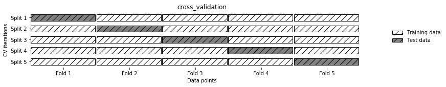
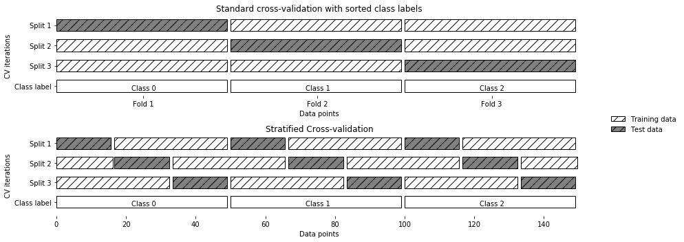
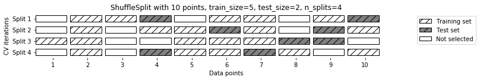
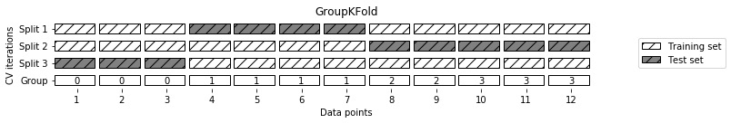
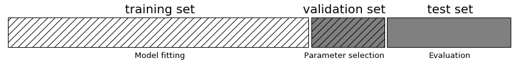
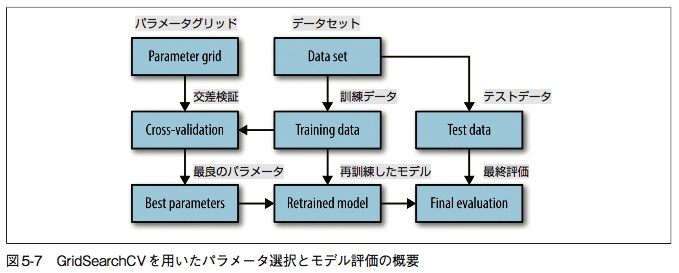
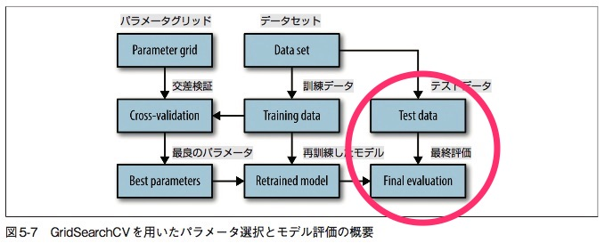

# データ確認
## カテゴリデータのチェック方法
人間が入力したデータ等の場合、表記ゆれが起きるので、一旦集計して確認する必要がある。  

### 方法
Pandas の Seriesクラスの value_counts関数で、各行に含まれているユニークな値と頻度を表示させる。

# 訓練データとテストデータを作る
## ダミー変数(ワンホットエンコーディング)を使う場合の注意点
- 出来上がるデータの列項目が、訓練データとテストデータで揃っているか？
  - 操作手順に気をつける
    - 手順A
      1. 全データを一括してダミー化
      1. 訓練データと、テストデータに分ける
  - 上記の手順に沿う事が難しい場合は、sklearn.feature_extraction.DictVectorizerが助けてくれるはず
- カテゴリ変数には見えないデータ(整数値データ)も、実はカテゴリ変数だったって事もあるよ！
  - アンケート仕様上「業種は？ -> 1：農業、2：サービス業・・」みたいなアンケートの回答を、数字で集計したようなデータの場合、見た目は整数データだけど、実際はカテゴリカル。
  - 整数値データを無理やりダミー変数化するのは、pandas.get_dummies関数で、columns=パラメタでダミー化したい列項目名を明示的に指定してやるとよい。
  ```
  demo_df['Integer Feature'] = demo_df['Integer Feature'].astype(str)
  display(pd.get_dummies(demo_df, columns=['Integer Feature', 'Categorical Feature']))
  ```

# 特徴量エンジニアリング(feature engineering)
モデルの仕様に合わせたり、モデルの精度を上げるために、特徴量(説明変数)をゴニョゴニョする事。

## 手法一覧
- モデルの仕様に合わせるための手法
  - ダミー変数化
    - カテゴリカルデータが使えない場合に、1,0で表される「ダミー変数」の形式に変換する手法の形式に変換する手法
- モデル精度を上げるための手法
  - ビニング
    - 数値データを、bin に区切って行く
    - 線形モデルで行うと、柔軟性が上がって精度が上がる
    - numpyで簡単につくれる
    ```
    bins = np.linspace(-3, 3, 11)
    which_bin = np.digitize(X, bins=bins)
    ```
    ```
    #ビニングした後は、それをさらにワンホット化する
    #scikitlearnの OneHotEncoderは、整数値で表現されたカテゴリカルデータしか、ワンホットに出来ない。
    from sklearn.preprocessing import OneHotEncoder
    encoder = OneHotEncoder(sparse=False)
    #encoder.fit で、which_bin に現れる整数値のバリエーションを確認させる
    encoder.fit(which_bin)
    #transform で実際に one-hot エンコーディングさせる
    X_binned = encoder.transform(which_bin)
    print(X_binned[:5])
    ```
  - 交互作用特徴量 (interaction feature)
    - 「ビニングしたデータのビン指示子✕実際のデータ」を特徴量としたもの
  - 多項式特徴量 (polynomial feature)
    - ある特徴量のべき乗(^1, ^2, ^3...)した値を、新たな特徴量として追加する手法
    - そうすると、なぜだかまろやかな回帰モデルが出来上がる
    - 線形回帰モデルと組み合わせると、古典的な__多項式回帰モデル__ となる
    - 高次元の多項式回帰モデルは、境界近辺やデータが少ない領域では極端な振る舞いをするのに注意
    - 線形回帰モデル✕多項式特徴量で、かなり柔軟なモデルは出来るが、SVMのような複雑なモデルを用いれば、わざわざ特徴量を新たに準備しなくても似たようなモデルを作れる
  - 単変量非線形変換
    - モデルがうまく機能するのは、特徴量がガウス分布している場合がほとんど。
    - 特徴量がガウス分布しないようなもの(ログイン回数などおべき乗分布)を、log,
     exp, sin を取ったりすることでガウス分布に近づける変換処理の事を言う。
  - 特徴量を取捨選択する
    - 大きな流れ(手順)
      1. 訓練データを使って、モデル精度を上げるのに深く関わっている特徴量を選び出す
      2. 選ばれた特徴量のみの訓練データで、モデルをフィットさせる
      3. テストデータでも同様に、選び出された特徴量のみを選んで予測し、精度を見る
    - 手法
      - 単変量統計 (univariate statistics)
        - 個々の特徴量とターゲット変数との間に、統計的に顕著な関係があるかどうかを計算する方法
        - メリット
          - 計算が高速
          - モデル作成不要
          - 特徴量選択後に使うモデルを限定しない(なんのモデルを使っても良い)
        - デメリット
          - 特徴量個々に見ていくので、他の特徴量と組み合わさって意味がある特徴量であっても、捨てられてしまう
        - Scikitlearn の場合、f_classif, f_regression の検定を用いて、p値が有意に差があるかどうかで判定させるらしい。
          - SelectKBest, SelectPercentlie クラスなどが、ヘルパー関数としてあるみたいしてあるみたい
      - モデルベース選択 (model-based selection)
        - モデル内に特徴量の重要度を計算するモデルを使い、重要な特徴量を選択する
        - 後に使うモデルと全然違うモデルで行ってもいいよ
        - モデル例
          - 決定木ベースのモデル(決定木、ランダムフォレスト)
            - feature\_importances\_属性として、それぞれの特徴量の重要度が保存されている
          - 線形回帰モデル
            - 偏回帰係数の絶対値をとれば、それが重要度とも言える
            - L1ペナルティを用いた線形回帰では、使う特徴量を絞る作用が中に組み込まれている
        - Scikitlearn では、SelectFromModelクラスがヘルパーとして使える
      - 反復選択 (iterative selection)
        - 再帰的特徴量削減 (Recursive Feature Elimination : RFE)
          - 全特徴量を使ってモデルを作り、もっとも重要度が低い特徴量を削除する。この作業を、事前に決めた特徴量数になるまで繰り返す手法
          - Scikitlearnでは、RFEというクラスがある
        - 増やしていく手法もあるらしい

## モデルの精度を上げるための勘所
### ほとんどのモデルで言えること
個々の特徴量がガウス分布に従っている時に、最もうまく機能する(精度が上がる)。  
回帰モデルの場合には、目的変数もガウス分布している時に、もっともうまく機能する。
### 特徴量操作別、モデル精度に関するメリット・デメリット
|特徴量操作|メリット|デメリット|
|:-|:-|:-|
|特徴量を増やす|線形回帰等ではモデルの柔軟性が増すこともある。|複雑になって、over fitting(過剰適合)する|
|特徴量を減らす|汎化性が増す。| --  |


## モデルの精度を下げてしまう要因
- ターゲット(説明変数)と特徴量が、非線形関係
  - 特に回帰モデルでは顕著に精度が下がる

## モデル別で、特徴量エンジニアリングを整理
### 決定木ベースのモデル
自分で重要な相互作用を見つける事ができるので、多くの場合、特徴量を明示的に変換する必要はない。
### 比較的単純なモデル(線形モデル、ナイーブベイズ)
ビニング、多項式、交互作用などの特徴量エンジニアリングの効果が出やすい。
### SVM、最近傍法、ニューラルネットワーク
ビニング、多項式、交互作用が功を奏することもあるが、線形モデルほど大きな影響はない。


# 5章 モデルの評価と改良
## 交差検証
### 交差検証(cross validation)とは
モデルの汎化性を確かめるための手法。  
手元にあるデータを、ランダムに(あるいは、あるルールに基づいて)分割してグループ化し、「1つをテストデータ」「残りを訓練データ」として使う。  
この流れを、全てのグループがテストデータとして利用されるまで繰り返す。  
つまり、例えば5分割する cross validation であれば、5回繰り返し、結果、決定係数が5つ出て来る事になる。  
この決定係数のバラ付きかたや、平均値をみて、どの程度汎化性があるのかを確認するのだ！  

\* クロスバリデーション処理のイメージ図


## 色々な交差検証
一口にクロスバリデーションと言えど、その分け方には色々なバリエーションがあるので、代表的なものだけ書いとくよ。
* k-fold cross validation (k分割交差検証)
* stratified k-fold cross-validation (層化k分割交差検証)
* leave-one-out (1つ抜き交差検証)
* shuffle-split cross-validation (シャッフル分割交差検証)

### k-fold cross validation (k分割交差検証)
手元にあるデータを頭からｋ分割して、それぞれをテストデータとして持ち回っていく手法。  

#### 主な用途
* とりあえずクロスバリデーション、の時
* 手元のデータが、完全ランダムに並んでる時

#### scikitelearn で書く
ランダムに選び出す(もちろん、被らないように)で良いなら、下記な感じ。
```
from sklearn.model_selection import KFold
kfold = KFold(n_splits=5)
print("Cross-validation scores:\n{}".format(cross_val_score(logreg, iris.data, iris.target, cv=kfold)))
```
cross_val_scoreで精度検証する場合、cvパラメタに分割用クラス(？)のインスタンスを渡してやると、善きに計らってくれるらしい！便利！

### stratified k-fold cross-validation (層化k分割交差検証)
ある特徴量のクラス値が、全体で何割位を占めてるかを見て、その比率と同じくらいの包含率になるようなグルーピングをして分割するやり方。

#### 主な用途
* 手元にあるデータで、カテゴリカルな特徴量を、訓練データにもテストデータにも出現させたい時

#### scikitlearn で書く
```
from sklearn.model_selection import StratifiedKFold
folder = StratifiedKFold(n_splits=3, shuffle=False, random_state=None)
cross_val_score(some_model, iris.data, iris.target, cv=folder)))
```
#### 処理イメージ


### leave-one-out (1つ抜き交差検証)
k分割交差検証のテストデータが、1つ(1レコード)しかないような処理。  
レコード数だけモデルを作るので、データ量が多いとすごい時間が掛かるのが玉にキズ。

#### scikitlearn で書く
```
from sklearn.model_selection import LeaveOneOut
loo = LeaveOneOut()
scores = cross_val_score(logreg, iris.data, iris.target, cv=loo)
print("Number of cv iterations: ", len(scores))
print("Mean accuracy: {:.2f}".format(scores.mean()))
```
### shuffle-split cross-validation (シャッフル分割交差検証)
テストデータの個数、訓練データの個数を柔軟に設定できる手法。  

上の図は、以下のような条件で行った交差検証のイメージです。
* 10個のグループ分けを行い、
* 毎回のイテレーションのたびに、テストデータを2つ、訓練データを5つ選び、
* イテレーション自体を4回繰り返す(4モデル作成)

#### scikitlearn で書く
```
from sklearn.model_selection import ShuffleSplit
shuffle_split = ShuffleSplit(test_size=.5, train_size=.5, n_splits=10)
scores = cross_val_score(logreg, iris.data, iris.target, cv=shuffle_split)
print("Cross-validation scores:\n{}".format(scores))
```
上のソースでは、テストサイズ、訓練サイズの指定をfloatで指定する事で、全体に対する割合で指定している。  
イテレーション回数は、10回。

#### シャッフル分割しつつ、stratified もするというゴツいやつも居る
ShuffleSplit クラス以外に、StratifiedShuffleSplit というまんまのクラスもあるので、クラス分類器を作る時や、ダミー変数を使う場合は使ってみようか。

### Cross-validation with groups (グループ付き交差検証)
たとえば、顔画像から感情認識をするためのデータの場合、同じ人の別の表情がいくつもあるようなデータを扱う事になる。  
このモデルでは、「そもそも、未知の人(＝訓練データには居ない人)の顔画像で、感情判定できてナンボ！」のはず。  
なので、テストデータに居る人の顔画像は、訓練データでは使いたくない。  
そういった願いを叶えるのが、グループ付き交差検証！  

#### 処理イメージ

上記の図では、イテレーションは3回、あるグループ(グループ0)のデータがテストデータとして使われる場合、訓練データにグループ0が存在しない。

#### scikitlearn で書く
```
from sklearn.model_selection import GroupKFold
#create synthetic dataset
X, y = make_blobs(n_samples=12, random_state=0)
#assume the first three samples belong to the same group,
#then the next four, etc
groups = [0, 0, 0, 1, 1, 1, 1, 2, 2, 3, 3, 3]
scores = cross_val_score(logreg, X, y, groups, cv=GroupKFold(n_splits=3))
print("Cross-validation scores:\n{}".format(scores))
```

## グリッドサーチ
### グリッドサーチとは
モデルのハイパーパラメータの最適化をするための手法。  
イメージ的には、いじれるパラメタの値を幾つかパターンを出し、それぞれの組み合わせを総当り戦的にスコア取得して行く。
### 使うデータについて
以下のような分け方をするよ！

全体のデータの中で、データは__3分割__する。  
最終的に使うテスト用のデータ(=test set)は、グリッドサーチでは__絶対触らない。__  
図表の中にある訓練データ(=training set)でモデルを構築する際、複数のパラメーターを使ってモデルを複数作成し、それぞれに対して validation set を使ってそのモデルの精度を見ていき、もっとも精度の高いパラメーターを判断する。  

### グリッドサーチの流れ

パラメーターをグリッドサーチする際、実際にはクロスバリデーションで精度検証をするのが普通。  
つまり、ある1組のパラメータパターンに対してクロスバリデーションした結果の精度平均を持って判断する。  
そうして選ばれた「ベストパラメーター」を用いて、改めて訓練データ(＝グリッドサーチで使ったデータ全体)を用いてモデルをフィットさせ、テストデータで最終的に精度を見る。  

### scikitlearn で書く
```
# どのパラメータの組み合わせでやるのかを、ディクショナリとリストで定義
param_grid = {'C': [0.001, 0.01, 0.1, 1, 10, 100],
              'gamma': [0.001, 0.01, 0.1, 1, 10, 100]}

# GridSearchCV インスタンス作成。
# 使いたいモデルインスタンスと、パラメタグリッド、CVスプリット数を指定。
# CVパラメタは、分割用のインスタンスを指定もできるよ！

from sklearn.model_selection import GridSearchCV
from sklearn.svm import SVC
grid_search = GridSearchCV(SVC(), param_grid, cv=5)

# テストデータと訓練データに分ける
X_train, X_test, y_train, y_test = train_test_split(
    iris.data, iris.target, random_state=0)

# 訓練データで、GridSearchCVインスタンスをフィットさせる
# 内部的にグリッドサーチが行われ、ベストパラメタが選ばれ、そのパラメタを用いたモデルで訓練データに対するフィットが行われる。
# GridSearchCVは、モデルのラッパー的なイメージ？
grid_search.fit(X_train, y_train)

# テストデータで精度確認。
# このテストデータは、グリッドサーチでは使ってないのがミソ
print("Test set score: {:.2f}".format(grid_search.score(X_test, y_test)))


# ベストパラメーターはここに格納
print("Best parameters: {}".format(grid_search.best_params_))

# そのベストパラメタのでのクロスバリデーションスコアは、ここに格納
print("Best cross-validation score: {:.2f}".format(grid_search.best_score_))

# 全てのパラメタにおける結果等は、cv_results_に格納
import pandas as pd
# データフレームにしとくと見やすいよ
results = pd.DataFrame(grid_search.cv_results_)
display(results.head())
```

### グリッドサーチの調整手法
一番のキモは、パラメータのグリッドを作成するところ。  
(前述ソースで言えば下記のところ)
```
# どのパラメータの組み合わせでやるのかを、ディクショナリとリストで定義
param_grid = {'C': [0.001, 0.01, 0.1, 1, 10, 100],
              'gamma': [0.001, 0.01, 0.1, 1, 10, 100]}
```
この値の最小値・最大値をどの程度にしておくかで、うまくグリッドサーチできるかどうかが決まる。
#### グリッドサーチの調整手順
1. 試してみたいパラメータに対して、極端に大きい(小さい)値を使って、予めスコアを見てみる
2. どの当たりまで値を変えると効きの違いがあるかを見定め、その効きがよい値が含まれる範囲でパラメーターのグリッドを作る
3. グリッドサーチしてみる
4. 精度が低い場合は、グリッドサーチの結果(cv\_results\_)のmean_test_scoreを可視化してみて、パラメーター別の精度に変化があるかどうかを確認
5. 変化が無ければ、2の見定めが悪かったので、2からやり直し
6. やり直してみてもだめな場合は、そもそもパラメータでそんなに変化しないんだと思うよ。。。

### 試したいパラメタできれいなグリッドが作れない場合は？
SVCモデルには、「kernel」というパラメタがある。kernel='linear'の場合、他に使えるパラメタは「C」だけだが、kernel = 'rbf'の場合、使えるパラメタは「C」と「gamma」の2つ。  
こういった場合に対処するため、scikitlearnでは引数で受け取るグリッド情報に「ディクショナリを要素としてもつリスト」を許容してある！
```
param_grid = [{'kernel': ['rbf'],
               'C': [0.001, 0.01, 0.1, 1, 10, 100],
               'gamma': [0.001, 0.01, 0.1, 1, 10, 100]},
              {'kernel': ['linear'],
               'C': [0.001, 0.01, 0.1, 1, 10, 100]}]
```
### 交差検証法を変えたい場合
cvパラメタに、分割器のインスタンスを与えたらイケるよ！
```

grid_search = GridSearchCV(
  SVC(), param_grid, cv = StratifiedShuffleSplit(n_splits=1)
  )
grid_search.fit(X_train, y_train)
```

### 最終テスト自体もクロスバリデーションしちゃう事もできる
個々までの説明では、最終的なテストは1回しか実施していない。  
(下記図の赤丸部分)

なので、このクダリでもクロスバリデーションさせると、より良いね！
#### スクリプト
```
param_grid = {'C': [0.001, 0.01, 0.1, 1, 10, 100],
              'gamma': [0.001, 0.01, 0.1, 1, 10, 100]}

# クロスバリデーションメソッドに食わせるモデルとして、GridSearchCVインスタンスを指定するだけで良い！
scores = cross_val_score(GridSearchCV(SVC(), param_grid, cv=5),
                         iris.data, iris.target, cv=5)
```
### 多くの組み合わせを一気に計算させるために
クロスバリデーション、グリッドサーチは、掛け算でイテレーション回数が増えていくので、場合によってはものすごい数の計算をする事になる。  
ただ、実際の計算過程では、並走可能な計算処理も多々ある。特に、グリッドサーチでは、各パラメタのクロスバリデーションはお互いの結果がお互いに影響し合うようなものではないので、並走可能。  
そこで、scikitlearnではCPUコアやクラスタを使って並列化するためのオプションがある。
```
# 指定の仕方は以下の通り
sklearn.model_selection.GridSearchCV(n_jobs=2)
sklearn.model_selection.cross_val_score(n_jobs=2)
```
