# 第2章 確率分布
## 確率分布とは
サイコロの目や、コインの表裏など、どのような値をとるのかが理論的に決まっている変数(＝ __確率変数__ )。
その確率変数が実際にとる値と、その値となる確率をしめしたものが、確率分布。

確率分布の面積の総和は、1になる。

## 確率分布の種類

- 離散型
    - 一様分布
        - 全ての確率変数のとる確率が一定の事象に関する分布
            - 1つのサイコロを振る時の、各目の出る確率分布
    - 二項分布
        - n回のベルヌーイ試行における成功回数xの分布
    - ポアソン分布
        - 試行回数nが大きい中で、まれにしか起こらない事象の生起回数xの分布
- 連続型
    - 正規分布
        - 試行回数nが大きい時の二項分布の近似分布
    - z分布 (標準正規分布)
        - 標準化した統計量z の分布
        - 平均は0、分散が1
    - t分布
        - 母分散の代わりに不偏分散を使ったt値の分布
        - 正規分布よりもやや平べったくなる場合が多く、平均は0
    - カイ二乗分布
        - z値をデータの数だけ平方和したカイ二乗値の分布
    - F分布
        - 2つの母集団から取ってきたカイ二乗、もしくは不偏分散の比であるF値の分布
        - 自由度が大きい場合の平均はほぼ1

## 2.2 二項分布から、正規分布へ

### 正規分布とは
- つりがね型のあれ。
- 二項分布の近似的分布

### 二項分布とベルヌーイ試行

#### 二項分布とは
- コイントスの結果の「表が出る・出ない」のような、結果が2つの値しか無い状況で
- ある回の結果が、次の回の結果に __影響を与えない__ (＝独立した)実験を繰り返した時に得られる確率分布

上記のような条件の実験の事を、 __ベルヌーイ試行__ と呼ぶ。

サイコロのように目が6つある場合でも、「3の目が出る・出ない」の実験であれば、ベルヌーイ施行となる。

二項分布が正規分布に近づいていくイメージ

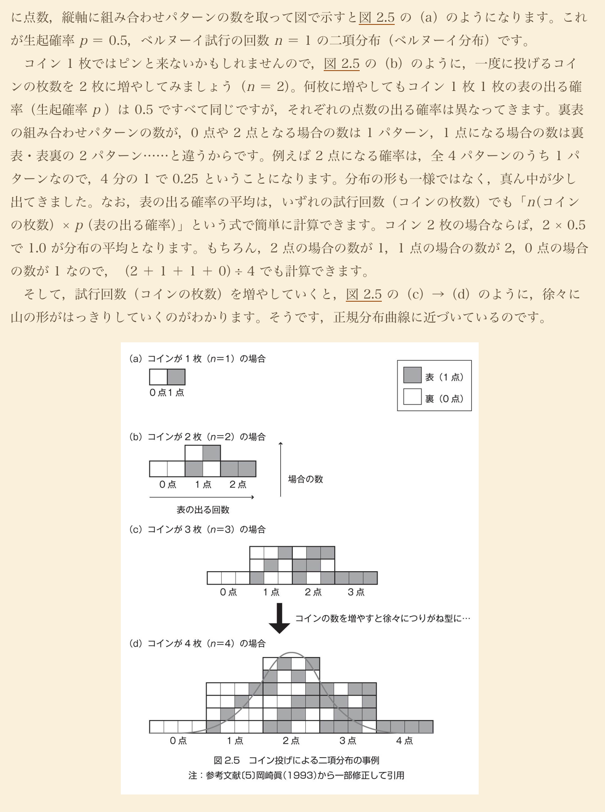

### 正規分布の確率密度関数

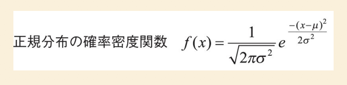

上記式のなかで用いられている、σ2乗(＝分散)、μ＝平均など、母集団の分布を決定づけるような
値(パラメータ)の事を、 __母数__ と言う。

「分母」との呼び間違いは恥ずかしいぞ！！

### 統計学分野でのお作法

- 標本についてはアルファベットをつかう
- 母集団についてはギリシャ文字を使う

## 2.3 正規分布の便利な性質

確率変数の場合、縦軸の値は「__確率密度__」と呼ぶよ。

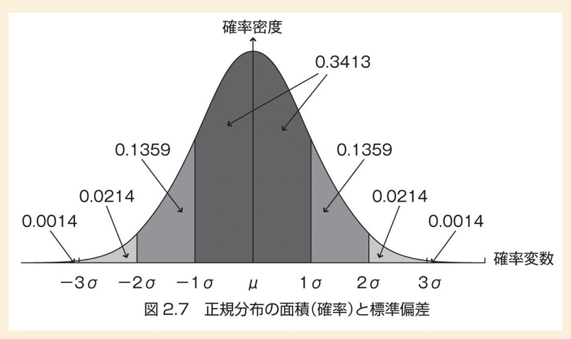

### 便利な性質
- μ ± 1σ の範囲に、全データのおよそ68％が収まる
- μ ± 2σ の範囲に、全データのおよそ95％が収まる

## 2.4 標準化と偏差値

色々と便利な正規分布。しかしながら、当然データごとに、分布の高さや横幅、位置は異なってくるので、異なる正規分布図になる。

これを、どんなデータでも、同じ位置の同じ幅高さの分布図で表現できたら、便利よねー。

という事で出来たのが、「__標準化__」というワザ。

### 標準化とは
平均を0、標準偏差(分散)を1」に変換する作業の事。

下記の式が、変換式。

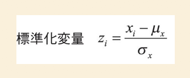

変換されたそれぞれのZ値は、以下のような分布になる。

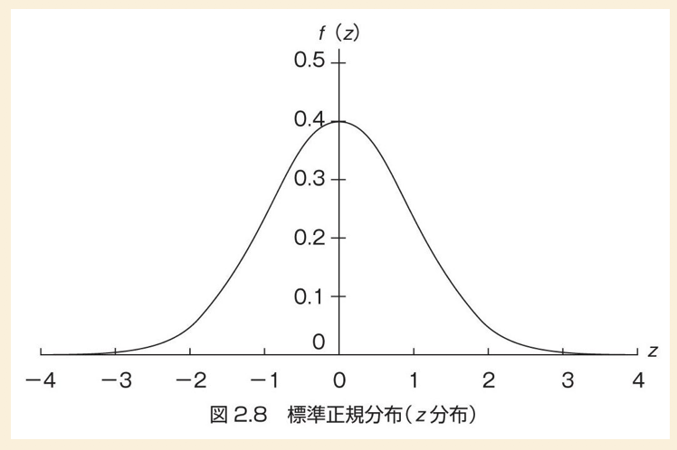

標準正規分布の確率密度関数は、以下の様な式になる。

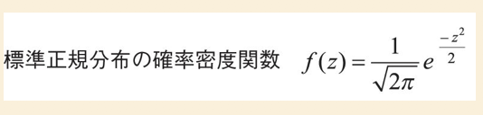

### 偏差値とは

高校時代の「偏差値」については、標準正規分布の平均を50点、標準偏差10点にしたもの。

偏差値の計算式は以下のようになる。

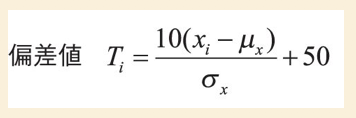

実際の偏差値の分布図は以下のようになる。

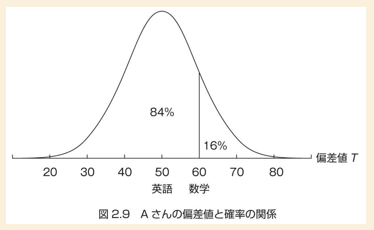

## 2.5 正規分布に関する統計量と、ポアソン分布

手に入れたデータが、正規分布しているのかどうかを確かめるための数値として、以下の2つが使いやすい。

- 歪度
- 尖度

### 歪度

pandas では、DataFrame.skew, Series.skew

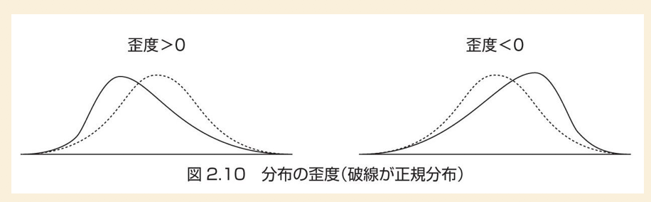

- 歪度 > 0
    - 正規分布とくらべて、裾野が右側に長い＝山の頂点が左側に歪む
- 歪度 < 0
    - 正規分布とくらべて、裾野が左側に長い＝山の頂点が右側に歪む

### 尖度

pandas では、DataFrame.kurtosis, Series.kurtosis

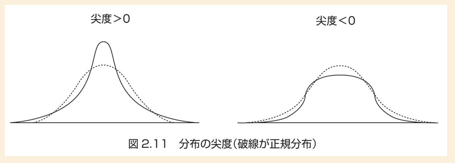

- 尖度 > 0
    - 正規分布と比べて、山の頂点が高い
    - 正規分布と比べて、山の頂点が低い(潰れてる)

### ポアソン分布

- 離散的分布
- 二項分布において、試行回数がとても多く、かつ極めて起こりにくい場合に、このポアソン分布になる。

#### 確率質量関数で表すと・・・

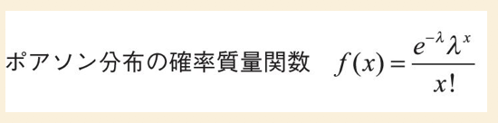

平均でλ回発生する事象が、x回発生すると考えられる確率の関数を現している。

- λ：n × p (n = 試行回数、p = 生起確率)

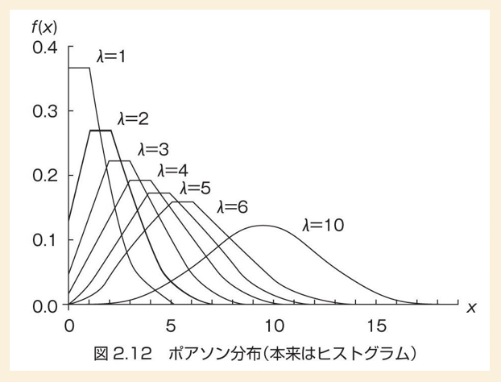

離散型の分布なので、本来はヒストグラム的表現にすべきだが、ここでは折れ線グラフで現している。

#### 因みに。

連続型の分布図を表現する「__確率密度関数__」に対し、
離散型の分布図を表現する式を、「__確率質量関数__」と呼ぶ。

### 分布表

標準正規分布する集団中のある値が、どれくらいの確率で出現するものなのかを、計算ではなく、表から探せるようにしたのが、__分布表__

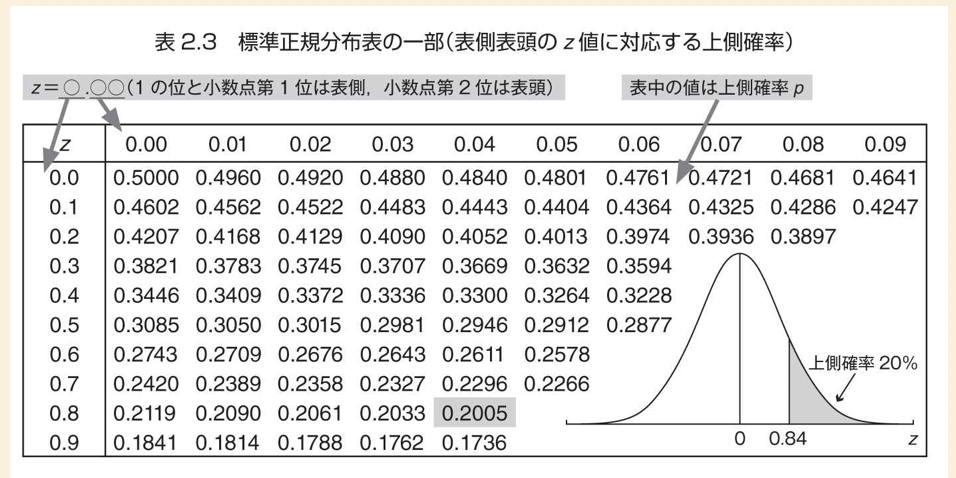

この分布表では、正規分布の上側確率を探せる表になってる。

ある値(標準化された値)が、0.84のものの上側確率を探すと、0.2005=20%になっている。

つまり、この値よりも低い値を取る確率は80％あり、これ以上の値をとる確率は20％、となる。