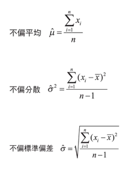
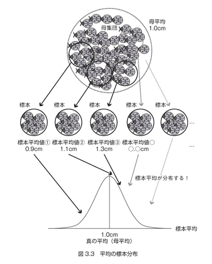
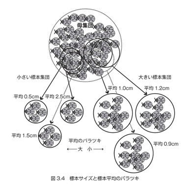
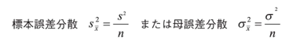
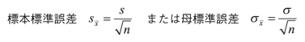
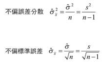
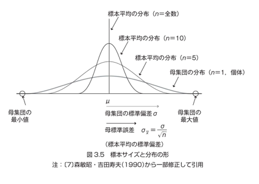
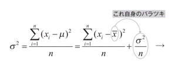
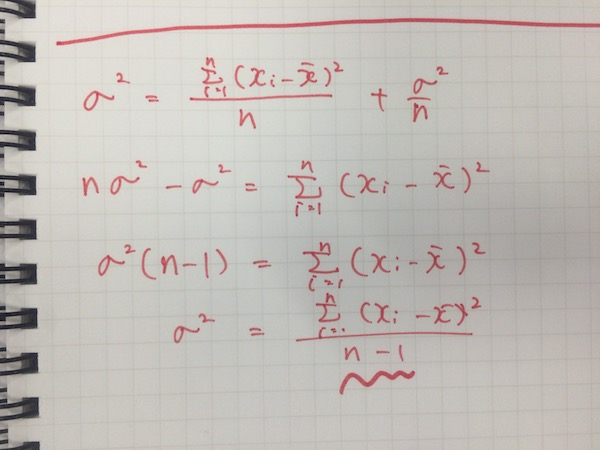

# 第3章 不偏推定量と標本分布 -推測統計学-

## 3.1 推測統計学

実験の本来の目的は、「実験で得る事ができた限られたデータから、全体の特性を推測する事」

実験の背後にある「未知の全体像」を知る必要がある。

標本から母集団の色々な特性について推測する統計学分野を＝ __推測統計学__

### 推測統計学の主な目的

- 「信頼区間の推定」を行う事
    - 母集団の特性(ex:平均、比率)の範囲を確率的に表す事
        - 例：品種Aの生育日数は、95%の確率で10~15日の間に入る
- 差の検定
    - 母集団Aと母集団Bの母数の間に差があるか否かを確率的に判定する事

統計学は単純な目的を持つ学問分野だが、差の検定だけでも、尺度や分布、グループ数の違いで様々な手法がある。

様々な手法を使いこなすためにも、しっかりとした基礎知識をつけようね！

## トピックス 母集団とユニバース

日本語の「母集団」には、英訳単語で「population」「Universe」と2つある。

2つの間には明確な意味の違いがある。

|英単語|意味|
|:--|:--|
|population|対象となるデータ項目(ex:身長) __のみ__ に限定した母集団のデータ|
|universe|対象となるデータ項目(ex:身長) __以外も含んだデータ__ の集合|

## 3.2 統計記号と不偏推定量

### 統計記号の整理

|用語|記号|説明|
|:-:|:-:|:--|
|母平均|μ|母集団の平均|
|母分散|σ 2|母集団の平均|
|母標準偏差|σ|母集団の標準偏差|
|標本平均|x&macr; (エックスバーのつもり)|標本の平均|
|標本分散|s2|標本の分散|
|標本標準偏差|s|標本の標準偏差|

### 不偏推定量

標本の値を使いながら、母数を推定した量(＝ __不偏推定量__)の計算式は以下の通り。

標本の値を使って母数の推定量を計算させる場合は・・・

- 母平均の推定量は、標本平均そのまま
- 母分散の推定量は、標本分散の数式の __分母が「n-1」__
- 母標準偏差の推定量は、標本標準偏差の数式の __分母が「n-1」__

標本は「無作為抽出」をされる事が前提となっているので、標本平均＝母平均推定量というのは、わりと納得できる。
しかし、分散・標準偏差などの「バラツキ」を表す数値の分母が、「n-1」となって、標本分散よりも「大きな値」になるように仕向けられているのは何故か？

直感的な理解としては・・・(私独自の考えをまとめてみる)

- 標本のバラツキ具合が、母集団のバラツキ具合を越える事は無い
    - バラツキを越えるケースは？
        - 抽出元よりもバラついたデータを拾うケース
            - つまり、母集団の各要素が取りうる値の範囲を超えた値を持ってくるケース
            - そんなことは不可能
        - ものすごく偏った標本抽出をしてしまっているケース
            - 「標本は無作為抽出であるべき」という原則を破ってしまっている
- よって、標本のバラツキ具合は、MAXでも母集団のバラツキと同じはず。
- 場合によっては、小さくなる事もあるでしょうよ。と。

という理解でよいのではないでしょうか。

## 3.3 平均の標本分布

### 標本分布とは

- 「標本平均の分布」のこと
- なぜ必要なのか？
    - ある標本データから、母集団の平均を計算する際(不偏統計量として算出する際)、どれくらいの誤差[1]が起こりうるのかを把握できれば、データの信用性を測る事が出来るが、そのためには各標本平均がどういった分布をしているのかを知る必要があるから

[1] この誤差の事を「__標本誤差__」という。定義は、標本平均と母平均の差分。

標本分布についての概念図は下記の通り。

### 標本分布(標本平均の分布)の特徴

> 標本分布は、標本サイズがある程度大きくなると、正規分布に近づく

## 3.4 標本分布のバラツキ

標本分布と、標本サイズにおける重要な関係性

> 標本サイズが大きくなるほど、標本分布のバラツキ(標本誤差)は小さくなる

標本分布と標本サイズについての関係性を簡単に図示すると、下記のようになる。

標本平均のバラツキを表す、標本平均の分散は、下記の数式で表せる。

なお、下記の数式は、標本平均にかぎらず、他の統計量(分散、標準偏差等)の標本誤差を表すことにも使えるので、「__誤差分散__」と言う。(多分・・・)

- n = 標本サイズ
- s2 = 標本分散

誤差 __分散__ が出せるなら、誤差の標準偏差(＝ __標準誤差__ と呼ぶ)も出せる。

標準誤差の式からは、標本サイズを4倍にすると、標準誤差は半分になる、という事が伺える。

未知の母集団の平均などを推測する場合に発生する標本誤差の大きさは、標準誤差を算出すると推し量る事ができる。

> とくに標準誤差は、様々な不偏統計量の精度を示す指標として使われる。

### ここでも、不偏推定量を考慮してみる

誤差分散や標準誤差の算出においても、不偏分散を算出した時の用に、__母集団のバラツキを越える事はない__ という事を考慮した「不偏」なものを考えておく必要がある。

なので、不偏推定量を用いた、「不偏誤差分散」「不偏標準誤差」は、下記の用になる。

## 3.5 まとめと標本平均と標準化

標本サイズと、標本分布がどのような関係にあるかをまとめた図が下記。

* n = 1 は、標本サイズが1。
    * つまり、個体観測
* n = 全数は、母集団の個体数すべて。
    * テントウムシ観測でいえば、この世の全てのテントウムシ全部について計測した、って事

## 3.6 自由度

母分散を求める事は、通常はできない(全数調査は無理だから)。
それ以外の母数も、基本は求めることができない。

そこで、手に入れることが出来る標本データから、なんとか母数を推定する事を試みる場合に、前節で出てきた「誤差分散」の考え方を使う事ができる。

母分散を推定する際に、標本分散を基軸にした考え方をしてみる。

標本分散から母分散を導出するためには、標本分散で使っている「標本平均」自体がバラつく事も考慮したい。
つまり、 __標本分散 ＋ 標本平均自体の分散(＝誤差分散)__ とすれば良さそうなのは、割りと直感的に理解できる。

つまり、手元にある1つの標本データから得られる標本分散に、母集団から得られる標本全体の標本平均たちの分散(＝母誤差分散)を足せば、母分散に近づくはず、という発想。(独自解釈)

上記の数式をσ2について解いてやると・・・

不偏分散の式が導出できた！分母が「n-1」になってる！

この「n-1」は、 __自由度__ と呼ばれている。
この自由度は、統計量の種類によって異なる。
平均の場合は、今回のように「n-1」となる。

### なぜ「自由度」と呼ばれるのか？

例えば、平均が10と決まっている場合の事を考えます。
要素数が3つ、と限定した場合、最初の2つの値は自由に決められますが、最後の1つの値は、自動的に決定されてしまいます。
たとえば、最初の2つの値として、5、10、を選んだ場合、最後の1つは有無を言わさず「15」に決定されます。

このことから、「平均」を考える際、自由な値を取ることが許されている要素数は「n-1」となり、この「n-1」の事を「自由な値を取る事が許されている要素数＝自由度」と呼ぶらしいよ！
