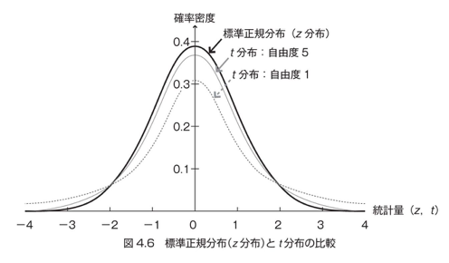

# 4章 信頼区間の推定

## 4.1 大数の法則と中心極限定理

ここまでの話では、「標本が複数手に入る事」を当然の事のようにして扱ってきたが、
実際の実験やデータ収集では、予算的に標本を複数採取できるようなケースは
殆ど無い。

その「1つの標本」から、母集団の事を如何に正しく推測するのかが勝負どころ。

その場合、手に入ったその1つの標本の標準誤差(標本分布のバラツキ)が小さいほど、
標本誤差(標本平均と母平均の差分)も小さくなり、不偏平均(標本から母平均を推測した値。実質、イコール標本平均)が、実際に母平均にグッと近づける。

### 母平均に近づけるために使える法則 〜大数の法則〜

標準誤差の式(再掲)

- s : 標本標準偏差
- n : 標本サイズ

上述式から分かる通り、推測の誤差を低くする(＝標準誤差を小さくする)ためには、

- 標本の標準偏差を減らす
- 標本サイズを増やす

のどちらかを行う必要がある。
実際に実験などで操作できるのは「標本サイズ」なので、誤差をなくしたいときは、
__可能な限り大きな標本サイズの標本から平均を求める__ 必要がある。

この「より大きいサイズの標本データから平均を求めると、真の平均に近づく」事を、
___大数の法則___ と言う。

### 中心極限定理

標本分布に関する定理で、便利なので紹介。

***定理：
母集団が正規分布でない場合も、ある程度の標本サイズがあれば、標本平均は正規分布に従う***

じつはこの定理があるおかげで、母集団が正規分布する事を前提とした手法でも、
この定理を使った回避策を適用すれば、難なく統計解析ができるようになるらしい！

## 4.2 信頼区間の推定の基礎

標本平均は、不偏推定量としての母平均ではあるものの、そこには必ず誤差がある。

そこで、標本の平均が10mm だった場合に、「母平均は10mm」と、ただの1点だけを母平均として推定するのではなく(＝ ***点推定*** )、

「母平均は、95%の確率で8mm ~ 12mm の間にある」という、幅をもたせた推定を行う。
これを、***区間推定*** と言う

区間推定における用語説明を、上述の例で解説しますと。。。

- 信頼係数 ： 95%
- 信頼区間 ： 8mm ~ 12mm
- 信頼限界 ： 8mm、12mmなどの、信頼区間の両端

区間推定は、母平均だけではなく、母比率、母分散でも使える手法。

### 母数の推定量としての標本平均の、信頼区間について

そもそも、標本とはある分布をしている(正規分布とは限らない)。  
その分布は、(標準化してしまえば)確率分布として見る事ができる。
確率分布であれば、積分すれば確率として算出ができる。

テントウムシの体長を例にする。

いま、手元に10匹のテントウムシ標本があって、体長の分布データを手にしている。
その標本の中で、体長が 1.2cm ~ 1.4cm の個体は何%いるのか？
・・・という問に対しては、標本分布を、標準化された確率分布に変化して、1.2 ~ 1.4の区間で積分してやれば算出できる。(これは、正規分布でなくてもOKですよね？)

そこで逆転の発想をして、上記標本の標本平均を中心にして、95%の振れ幅を許した場合、体長が最小の個体と、最長の個体の体長はどれくらいなのか？
・・・という事に対しても、算出できますよね。

つまり、1つの標本で、95%の範囲の体長が分かるよ、と。

この作業を何度か繰り返した時の事を考える。

標本平均の分布は、母平均を中心に正規分布である事が分かっている。

この上で、各標本の95%区間を並べてみる。
各95%区間に対して、母平均が入る確率も、95%になりそうなのは、なんとなく分かるよね？！
(TODO 理解が雑なので、いつかしっかり理解したい)

### 信頼係数の意味

とある標本から算出された95%信頼区間、その区間内に、母数が入る確率が、95%。
裏を返すと、5%は入らない。

時間軸を含めたイメージは、下記URLが分かりやすい。

http://rpsychologist.com/d3/CI/

## 4.3 正規分布による区間推定 母分散が既知、もしくは大標本の場合

> この本の解説があまりに理解できなかったので、別の本で学んだ事を箇条書きでまとめておく。

- 中心極限定理より、標本サイズがある程度大きければ、標本平均分布は正規分布する事が分かっている。
- 標本平均の値の分布は、標準偏差 $\sigma_{\bar{x}} = \frac {\sigma} {\sqrt{n} }$ のバラツキを持つ正規分布である事も分かっている。
- そして、母集団の分布がどうであれ、母集団からサンプリングしたデータの平均(＝標本平均)を95%の確率で言い当てるためには、標本分布( $ N(\mu, \frac {\sigma} {\sqrt{n}})$ )の95%予言的中区間を計算すれば良い
- つまり、$ -1.96 \frac {\sigma} {\sqrt{n}} \leqq \bar{x}_1 - \mu \leqq 1.96 \frac {\sigma} {\sqrt{n}} $ が、95%予言的中区間。
	- $\bar{x}_1$ : 1回のサンプリングで抽出した標本の平均
- 上記を $\mu$ について解いてやると、意味的には、 ***「得られた標本から 、95%の的中確率で予測できる母平均の範囲は、 $ \bar{x}_1 - 1.96 \frac {\sigma} {\sqrt{n}} \leqq \mu \leqq \bar{x}_1 + 1.96 \frac {\sigma} {\sqrt{n}} $」*** となる。
- これは、手に入れる事ができた、たった1つの標本から推察する(＝区間推定する)事ができる、母平均の範囲
- 母分散( $\sigma$ ) が既知であれば、数値として算出できる
- ただし、この区間推定は、 ***たった1つの標本*** から行ったもの
- サンプリングを何度か繰り返せば、その回ごとに、別々の推定区間が算出される。
- つまり、サンプリングのたびに、バラバらの推定区間が出来上がるので、たった1度の区間推定をしただけで、「絶対、95%の確率で、この範囲に母平均 $\mu$ が収まる」とは言い切れない！
	- つまり、この1回だけでは予測はできない。
- でも、実際、推測でできる事はここまでなんです・・・
- じゃあ、この推定区間は、母平均の予測に対してどのような意味を持つ区間なのか・・？
	- 数学的に証明されていて、下記のような意味になる。
	- サンプリングを何度も繰り返しながら、上述の95%の予言的中範囲を利用して区間推定を何度も行うとする。100回の区間推定をした場合、95個の推定区間の間に母平均が収まっている事になる。
	- このような意味をもつ、上述の区間の事を、 ***「95%信頼区間」*** と呼ぶ事になっている

## 4.4 t分布による区間推定

### t分布の概要

> 4.3節の流れを組み、別本からのt分布による区間推定の解説を行う

- 母分散が既知の場合のやり方の場合は、母分散が既知であるがゆえに、予言的中区間のの不等式を、母平均について解くことが出来た
- もし、 ***母平均以外は既知の値(＝標本から計算できる値)だけで計算できる統計量で、かつ、その分布が分かっているものを見つけられたら*** 4.3節の流れと同じようにして、母平均の信頼区間を出す事ができる
- そして、そんな統計量、 ***$ T= \frac {(\bar{x} - \mu) \sqrt{n-1}} {s} $*** を見つけたのが、ゴセットさん！
	- $\bar{x}$ : 標本平均
	- $\mu$ : 母平均
	- $n$ : サンプルサイズ
	- $s$ : 標本標準偏差(不偏ではない)
- $T$ は、自由度( $n-1$ )によって異なる分布になる
	- 自由度が大きくなるほど、正規分布に近づく(＝山が高くなる)
	- 
	- 正規分布よりも、山が低くて裾のの厚みが高いイメージを持っておくこと
		- つまり、同じ95%予言的中区間を積分して算出した場合でも、t分布の方が広く出る

### t分布の正式な定義

> ここでも、別本を見ながら、正式な定義について学んでおくよ

統計量 $T$ の正式な定義は、以下の通り。

$ T = \frac {z \sqrt{k} } {\sqrt{W}} $
- $z$ : 標準正規分布のデータ
- $k$ : $W$ の自由度
- $W$ : カイ二乗分布するデータ

つまり、 ***t分布は、正規分布と、カイ二乗分布をつかって定義される分布*** になる。

ここで、***標準正規分布のデータ = 標本平均の分布*** の場合を考えてみる。
(自然なストーリーでいえば、「手に入れた標本を使って、母平均の推察をする場合」を考えてみる、ということになる)

つまり、上の式でいうところの $z, k, W$は、以下のようになる。

- $ z = \frac {\bar{x} - \mu} { \frac {\sigma} {\sqrt{n}} }$
- $ W = \frac {s^2 n} {\sigma ^ 2}$
- $ k = n-1$ (標本サイズ $n$ の自由度)

$ T = \frac {z \sqrt{k} } {\sqrt{W}} $ に、上記の値を代入して解いてみると・・・

$$
\begin{aligned}
T &= \frac {z \sqrt{k} } {\sqrt{W}} \\
	&= \frac {\frac {\bar{x} - \mu} { \frac {\sigma} {\sqrt{n}} } \sqrt{n-1} } {\sqrt{\frac {s^2 n} {\sigma ^ 2}}} \\
	&=\frac {\frac {\bar{x} - \mu} { \frac {\sigma} {\sqrt{n}} } \sqrt{n-1} } {\frac {s \sqrt{n}} {\sigma}} \\
	&= \frac {\bar{x} - \mu} { \frac {\sigma} {\sqrt{n}} } \sqrt{n-1} {\frac {\sigma} {s \sqrt{n}}} \\
	&= \frac {(\bar{x} - \mu) \sqrt{n-1}} {s}
\end{aligned}
$$

となり、なんと母数の $\sigma$ が消え去る！すげー！

よって、以下の手順で母平均が求まる！(標本データだけで！)

1. 統計量 $T$ を算出
1. $T$ の分布である t分布 の分布表から、求めたい信頼係数に相当する信頼限界値を抽出して不等式を作る(＝$T$ の予言的中区間を不等式で表現する)
	- 自由度( = $n-1$)によって、分布が変わるので注意
1. その不等式を、母平均について解いてやる
1. 母平均の信頼係数分の信頼区間が求まる！

実際に、上の流れを、標本サイズ10、信頼係数95%で区間推定やってみると・・・

まずは普通に代入。

$$
\begin{aligned}
-2.262 &\leqq T &\leqq 2.262 \\
-2.262 &\leqq \frac {(\bar{x} - \mu) \sqrt{n-1}} {s} &\leqq 2.262 \\
\end{aligned}
$$

これを、$\mu$ について解くと・・・

$$
\bar{x} - 2.262 \frac {s}{\sqrt{n-1}} \leqq \mu \leqq \bar{x} + 2.262 \frac {s}{\sqrt{n-1}}
$$

となる。

あとは、手元にある標本データから、$\bar{x}, s, n$ を代入してやれば、$\mu$の範囲が決まる。

## 4.5 母比率の信頼区間の推定

> ここでも、今までの流れと同じ解説を独自に展開してみるよ。

### Wald の推定法

標本サイズが充分に大きい場合は、この推定法が使える。

- 標本平均の分布が、平均 $\mu$ 、標準偏差 $\frac {\sigma} {\sqrt{n}}$ の正規分布をする事が分かっているのと同じように
- 標本比率(標本サイズｎの比率調査)の分布も、平均 $p$,  標準偏差 $\frac {\sqrt{p(1-p)}} {\sqrt{n}}$ の$N(p, \frac {\sqrt{p(1-p)}} {\sqrt{n}})$の正規分布をする事が分かっている
	- $p$ : 母比率
	- $n$ : 標本サイズ
	- ただし、ｎが充分に大きい時。ｎが小さいときは、二項分布になるらしい。多分。
	- 二項分布は離散的な分布で、標本サイズを大きくして連続的な分布にしてやると、正規分布になるらしい
- つまり、一度のサンプリングで得られた標本比率($\hat{p}_1$)を、95%の的中率で予言するためには、$ -1.96\frac {\sqrt{p(1-p)}} {\sqrt{n}} \leqq p - \hat{p}_1  \leqq 1.96 \frac {\sqrt{p(1-p)}} {\sqrt{n}} $ が成立するような区間を言えば良い。
- これを、母比率 $p$ について解けばよい・・が・・・
- これは実際解けない。
- そこで、$n$ が充分に大きければ、$\frac {\sqrt{p(1-p)}} {\sqrt{n}}$ の $p$ を、$\hat{p}_1$ に置き換えても問題ない事が分かっているので(標本比率は、母比率の一致推定量なので・・・らしい・・・意味不明)、実際に置き換えた式は、
- $ \hat{p}_1 -1.96\frac {\sqrt{\hat{p}_1(1-\hat{p}_1)}} {\sqrt{n}} \leqq p   \leqq \hat{p}_1 + 1.96 \frac {\sqrt{\hat{p}_1(1-\hat{p}_1)}} {\sqrt{n}} $
- これで、標本データから、母数を推定できる！

### Agresti-Coullの推定法
というのもあるらしい。
小標本サイズの時は、この推定法の方がいいらしい。

- 標本サイズが小さい時は、対象となる事象が起こる比率が不安定になってる可能性(＝標本比率が0.5以下のものは、母集団ではもっと多い可能性、標本比率が0.5以上のものは、母集団ではもっと少ない可能性)がある
- それを上手いこと補正する方法が、Agresti-Coullの推定法(多分・・・)
	- 標本上で起こった対象事象回数を2回割増、標本サイズを4つ割増して算出する $\hat{p}'$ を、対象事象の確率とみなしてしまう!!
		- $\hat{p}'$ : (対象となった事象が起こった回数 ＋ 2) ÷ (総数＋4)
	- そして、標本比率の分布を考える際、その散らばり(標準誤差)を、$\frac {\sqrt{{\hat{p}'(1 - \hat{p}')}}} {\sqrt{n+4}}$ とする

まとめると、母比率の95%信頼区間は・・・

$\hat{p}' - 1.96 \frac {\sqrt{{\hat{p}'(1 - \hat{p}')}}} {\sqrt{n+4}} \leqq p \leqq \hat{p}' + 1.96 \frac {\sqrt{{\hat{p}'(1 - \hat{p}')}}} {\sqrt{n+4}}$

- $\hat{p}'$ : (対象となった事象が起こった回数 ＋ 2) ÷ (総数＋4)

### 選挙で当選確実情報を出す際の種明かし

$ \hat{p}_1 -1.96\frac {\sqrt{\hat{p}_1(1-\hat{p}_1)}} {\sqrt{n}} \leqq p   \leqq \hat{p}_1 + 1.96 \frac {\sqrt{\hat{p}_1(1-\hat{p}_1)}} {\sqrt{n}}$

上述 Wald法で、標本データ(例：Aさんの得票率)を左辺に入れ見て、50%を超えていた場合、そのAさんは「当選確実」と言っても良い。

### 標本サイズの決め方

「どれだけの標本サイズがあれば、統計的な判断が下せる標本になるのか？」を考えてみる。

- Waldの推定法において、母比率 $p$ が、出来るだけ狭い範囲に収まってくれれば、その標本を使って何かしらの判断をしてもよい、といえる。
- ということは、右辺・左辺にある、$1.96\frac {\sqrt{\hat{p}_1(1-\hat{p}_1)}} {\sqrt{n}}$ が、出来るだけ小さくなるような、$n$ (標本サイズ)を集めればよい、となる。
	- ただし、95%信頼区間を考える場合。それ以外の信頼係数のときは、1.96の部分が変わるよ！
- たとえば、母比率が、手にした標本比率の $\pm$ 5% に収まっていれば、その標本データを使って何かしらの判断をしてもよい、としよう。
- その場合、$1.96\frac {\sqrt{\hat{p}_1(1-\hat{p}_1)}} {\sqrt{n}} = 0.05$ となる $n$ を考える事になる。
- $\hat{p}_1$ がまだ不明なので、まだ $n$ について解くことが出来ない。
- そこで、「標本比率が、もっとも狂ってしまうケース」を考える。
- つまり、$1.96\frac {\sqrt{\hat{p}_1(1-\hat{p}_1)}} {\sqrt{n}}$ が、もっとも大きくなってしまうケース。
- それは、$\hat{p}_1(1-\hat{p}_1)$ が最大値を取るケース。
- つまり、$\hat{p}_1=0.5$
- $\hat{p}_1=0.5$ の時が、同じ標本サイズ $n$ の時の、最悪のバラツキをもたらすケースなので、この「最悪のケース」を想定した、標本サイズを押さえておきたい。
- 数式で表わせば、$1.96\frac {\sqrt{0.5 \times 0.5}} {\sqrt{n}} = 0.05$ の時の $n$ が、最低限必要な(最悪のケースが起きたときでも、信頼ある標本データとなる)標本サイズとなる。
- 解くと、 $n \risingdotseq 384$ となる。
