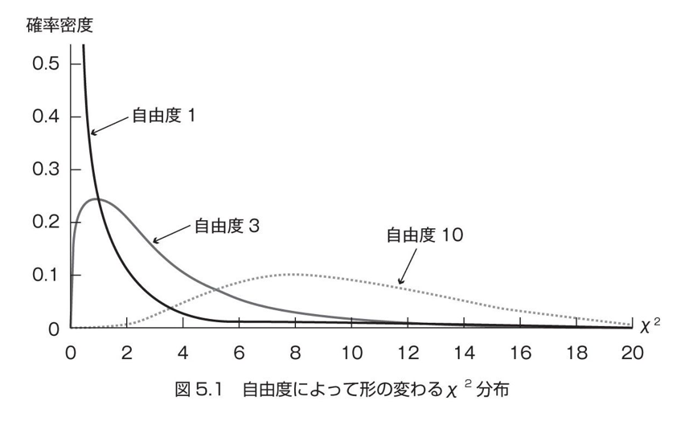

# $\chi^2$分布と $F$分布

## $\chi^2$分布

- $\chi^2$分布とは
  - ***標準正規分布する母集団から、標本サイズ $n$ の標本を抽出し、個々の値を二乗した値の和が従う分布*** の事。

- $\chi^2$分布の特徴
  - 自由度(n-1)によって確率密度関数が異なる
    - t分布とかと似たノリのやつ

式で表すと・・・

$\begin{aligned}
\chi^2_{(n)} \equiv z_{1}^2 + z_{2}^2 + ... + z_{n}^2
& = \frac {(x_{1} - \mu)^2} {\sigma^2} + \frac {(x_{2} - \mu)^2} {\sigma^2} + ... + \frac {(x_{n} - \mu)^2} {\sigma^2} \\
& = 	\displaystyle\sum_{i=1}^n	z_{i}^2	\\
& = \displaystyle\sum_{i=1}^n	 \frac {(x_{i} - \mu)^2} {\sigma^2}
\end{aligned}
$

- $\chi^2_{(n)}$ : サンプルサイズが $n$ 個の時(=自由度が $n$)の $\chi^2$ 値
  - 今のところ、使っている平均は母平均なので、自由度も特になんの制約も受けず、自由度＝サンプルサイズとなる
- $z_{1}$ : 正規分布する母集団から抽出したデータを標準化した値(= $\frac {(x_{1} - \mu)^2} {\sigma^2}$)
- $\mu$ : 母平均
- $\sigma$ : 母分散

自由度別の $\chi^2$分布の様子

## 母分散の区間推定
母数である母分散を推定するために、前述のカイ二乗式を使う事を考えた場合、$\mu$ が邪魔。
そこで、母平均の標本推定量である「標本平均」を上手く使えないか？を考えてみる。

実際、母平均を標本平均に置き換えた数式(= W とする)は以下の通り。

$\begin{aligned}
W & = \frac {(x_{1} - \bar{x})^2} {\sigma^2} + \frac {(x_{2} - \bar{x})^2} {\sigma^2} + ... + \frac {(x_{n} - \bar{x})^2} {\sigma^2}
\end{aligned}
$

ここで、不偏分散の定義式を思い出してみる。

$ \hat{\sigma}^2 = \frac { (x_{1} - \bar{x})^2 + (x_{2} - \bar{x})^2 + ... +  (x_{n} - \bar{x})^2} {n-1} $

分子が一致している部分を利用して、式をつなげてみる。

$
\begin{aligned}
(n-1) * \hat{\sigma}^2 &= \sigma^2 * W \\
\sigma^2 &= \frac{(n-1) * \hat{\sigma}^2} {W} --- (1)
\end{aligned}
$

ここで、実は ***$W$ は、自由度 (n-1) のカイ二乗分布に従う*** 事が分かっている。
つまり、
$
W = \chi^2_{(n-1)} = \frac {\textstyle\sum_{i=1}^n	(x_i-\bar{x})^2} {\sigma^2} --- (2)
$
- $\chi^2_{(n-1)}$ の下付き数字 $n-1$ は自由度を表すものであり、サンプルサイズはあくまで $n$ である事の注意

式(1)に、式(2)を代入すると、

$
\sigma^2 = \frac{(n-1) * \hat{\sigma}^2} {\chi^2_{(n-1)}}
$

ここで、
- 不偏分散は計算算出可能
- カイ二乗分布の密度関数は既知
- つまり、95％予言的中率で言い当てられる
- つまり、母分散を言い当てられる！

となる。

母分散が取りうる値を式で表現するために、書式ルールとして、、、
- $\chi_{(n-1, \frac{\alpha} {2})}^2$ --- 自由度 $n-1$のカイ二乗分布において、予言的中率 $\alpha$ の区間の上限信頼限界
- $\chi_{(n-1, 1-\frac{\alpha} {2})}^2$ --- 自由度 $n-1$のカイ二乗分布において、予言的中率 $\alpha$ の区間の下限信頼限界

という書式で書くとした場合、信頼係数 $\alpha$の母分散の予言的中区間は、

$
\frac{(n-1) * \hat{\sigma}^2} {\chi^2_{(n-1, \frac{\alpha} {2})}} \leqq \sigma^2 \leqq \frac{(n-1) * \hat{\sigma}^2} {\chi^2_{(n-1, 1-\frac{\alpha} {2})}}
$

となる。
左辺、右辺、ともに算出可能なので、言い当てられる！
カイ二乗値は、下の表からわかる！
下の表では、自由度4(サンプルサイズ5)、信頼係数95％のカイ二乗値の上限下限信頼限界がハイライトされている。

## 5.3 $F$分布

### $F$ 分布とは
$F$値が従う分布

### $F$値とは
標準正規分布に従う2つの母集団から無作為抽出してきた2つの $\chi^2$値の比。
ただし、$\chi^2$値は自由度によって大きく異なるので、各$\chi^2$値は、それぞれの自由度で割る。
つまり、式で表すと・・・

$
F_{(\nu_1, \nu_2)} = \frac{\textstyle \frac {\chi_{(\nu_1)}^2} {\nu1} } {\textstyle \frac {\chi_{(\nu_2)}^2} {\nu2}}
$
- $\nu$ : 自由度

となる。

### $F$ 分布の特徴
- $F$分布は、$\chi^2$分布とは異なり、いくら自由度が高くなっても正規分布のような左右対称型にはならない。
- 両方の自由度が充分に大きくなると、平均は1に近づく
  - 上記の性質はイメージできるようになっておきましょう。

## 5.4 特別な $F$値
後に出てくる$F$検定や分散分析では、ある特定条件の$F$値を利用する事が前提になるので、その「特別な$F$値」をここで導いておく。

### $F$ 値が2つの不偏分散の比になるパターン
まず、カイ二乗の定義を、自由度 $\nu$ を使って表す。

$\begin{aligned}
\chi^2_{(n)} &\equiv z_{1}^2 + z_{2}^2 + ... + z_{n}^2 \\
& = \displaystyle\sum_{i=1}^n	 \frac {(x_{i} - \mu)^2} {\sigma^2} \\
& = \frac {\sum_{i=1}^n (x_{i} - \mu)^2} {\sigma^2} \\
& = \frac {\nu \hat{\sigma}^2 } {\sigma^2} \\
\end{aligned}
$

ということは、

$\begin{aligned}
F_{(\nu_1, \nu_2)} & = \frac{\textstyle \frac {\chi_{(\nu_1)}^2} {\nu1} } {\textstyle \frac {\chi_{(\nu_2)}^2} {\nu2}} \\
& = \frac{{\frac {\nu_1 \hat{\sigma_1}^2 } {\sigma_1^2}} / {\nu1} } {{\frac {\nu_2 \hat{\sigma_2}^2 } {\sigma_2^2}} / {\nu2}} \\
& = \frac{{\hat{\sigma_1}^2 } / {\sigma_1^2}} {{\hat{\sigma_2}^2 } / {\sigma_2^2}}
\end{aligned}
$

と変形できる。

ここでさらに、仮にこの$F$値を構成する2つの$\chi^2$値が、_同一の母集団から抽出されたと仮定_ した場合を考えると、$\sigma_1 = \sigma_2$ となり、上記の式は

$\begin{aligned}
F_{(\nu_1, \nu_2)}
& = \frac{{\hat{\sigma_1}^2 } / {\sigma_1^2}} {{\hat{\sigma_2}^2 } / {\sigma_2^2}} \\
& = \frac {\hat{\sigma_1}^2} {\hat{\sigma_2}^2}
\end{aligned}
$

となり、それぞれの標本の不偏分散となる。

### $F$値と $t$値の関係

標本平均の標準変化量 $t_{\bar{x}}$ を、無理やり $z$を使った式に変形させると・・・

$\begin{aligned}
t_{\bar{x}} &= \frac{\bar{x_i} - \mu} { {\hat{\sigma}_{\bar{x}}} } \\
&= \frac{\bar{x_i} - \mu} { \hat{\sigma} / \sqrt{n} } \\
&= \frac{ \frac {\bar{x_i} - \mu} {\sigma / \sqrt{n}} } { \frac {\hat{\sigma} / \sqrt{n} } {\sigma / \sqrt{n}} } \\
&= \frac{ z_{\bar{x}} } {{\hat{\sigma}} / {\sigma} }\\
\end{aligned}
$

ここで、さっきの

$\begin{aligned}
\chi^2_{(\nu)}= \frac {\nu \hat{\sigma}^2 } {\sigma^2} \\
\end{aligned}
$

を代入すると、

$\begin{aligned}
t_{\bar{x}}
&= \frac{ z_{\bar{x}} } {{\hat{\sigma}} / {\sigma} }\\
&= \frac{ z_{\bar{x}} } { \sqrt{ \chi^2_{(\nu)} / \nu } }\\
\end{aligned}
$

と変形できる。

ここで、$t_{\bar{x}}$ を二乗すると・・・

$\begin{aligned}
t_{(\nu)}^2 &= \frac{ z_{\bar{x}}^2 } { \chi^2_{(\nu)} / \nu } \\
&= \frac{ \chi_{(1)}^2 / 1 } { \chi^2_{(\nu)} / \nu } \\
&= F_{(1,\nu)}
\end{aligned}
$

となって、$F$値の内、分子側の自由度が1の場合のF値になる.
(自由度1の $\chi^2$ は、$z^2$ となる事を思い出しておくべし)

この、「分子が自由度1」という制限は、分散分析における2群の場合の検定や、多重比較で用いる条件になるので、このF値が有効に使える、という事らしい。

また、自由度1の群がある場合のF検定は、t検定をする事にもつながるらしい。
