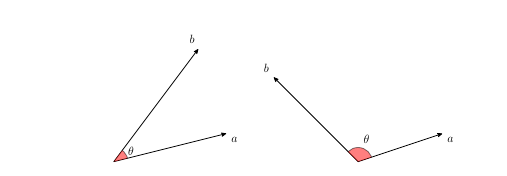

The Names and Descriptions of Variables in the Constitution Preamble Data.  The data set contains the raw textual information about the preambles of constitutions around the world.
 
Some scholars argue that over the last centuries, the US constitution has emerged, either verbatim or paraphrased, in numerous founding documents across the globe. Will this trend continue, and how might one even measure constitutional influence, anyway? 

This exercise is in part based on David S. Law and Mila Versteeg. (2012). 'The Declining Influence of the United States Constitution', *New York University Law Review* Vol. 87, No. 3, pp. 762--858, and Zachary Elkins, Tom Ginsburg, and James Melton. (2012).  'Comments on Law And Versteeg's the Declining Influence of the United States Constitution.' *New York University Law Review* Vol. 87, No. 6, pp. 2088--2101

One way is to measure constitutional influence is to see which constitutional rights (such as free speech) are shared across the founding documents of different countries, and observe how this commonality changes over time.  An alternative approach, which we take in this exercise, is to examine textual similarity among constitutions.  We focus on the preamble of each constitution, which typically states the guiding purpose and principles of the rest of the constitution. 

The data in the file `constitutions.csv` has variables:

-----------------------------------------------------------------------------
 Name                 Description
 -------------------- -------------------------------------------------------
 `country`            The country name with underscores 
 
 `year`               The year the constitution was created
 
 `preamble`           Raw text of the constitution's preamble
-----------------------------------------------------------------------------
 
## Question 1

First, let's visualize the data to better understand how constitutional documents differ. Start by importing the preamble data into a dataframe, and then preprocess the text.  Before preprocessing, use the `VectorSource` function inside the `Corpus` function.  Create two data matrices for both the regular document term frequency, and for the tf-idf weighted term frequency. In both cases, visualize the preamble to the U.S. Constitution with a word cloud. How do the results differ between the two methods? Note that we must normalize the tf-idf weights by document size so that lengthy constitutions do not receive greater weights.

## Answer 1

We begin preprocess the data by computing a document-term matrix and 
weighting it.

```{r}
library("tm", "SnowballC")
## Import data, convert to corpus, do preprocessing
constitutions <- read.csv("data/constitutions.csv")
corpus <- Corpus(VectorSource(constitutions$preamble))
## preprocessing
corpus <- tm_map(corpus, content_transformer(tolower))
corpus <- tm_map(corpus, stripWhitespace)
corpus <- tm_map(corpus, removePunctuation)
corpus <- tm_map(corpus, removeNumbers)
corpus <- tm_map(corpus, removeWords, stopwords("english"))
corpus <- tm_map(corpus, stemDocument)
## Two document-term matrices: tf and tf-idf
dtm <- DocumentTermMatrix(corpus)
dtm.mat <- as.matrix(dtm)
rownames(dtm.mat) <- constitutions$country # add label
tfidf <- weightTfIdf(dtm, normalize = TRUE) # normalize by document size
tfidf.mat <- as.matrix(tfidf, normalize = TRUE) 
rownames(tfidf.mat) <- constitutions$country
```

Now, we create word clouds. 

```{r, warning=FALSE}
par(cex = 1.25)
## word clouds
library("wordcloud")
us.tf <- dtm.mat["united_states_of_america",]
us.tfidf <- tfidf.mat["united_states_of_america",]
wordcloud(colnames(dtm.mat), us.tf, 
          min.freq = min(us.tf[us.tf > 0]))
wordcloud(colnames(tfidf.mat), us.tfidf, 
          min.freq = min(us.tfidf[us.tfidf > 0]))
## top 5 words
sort(us.tf, decreasing = TRUE)[1:5]
sort(us.tfidf, decreasing = TRUE)[1:5]
```

The largest words for the wordcloud based on term frequency are `state`, `unit`, and `establish`. Recall that term frequency only considers term counts within a single document, analyzing the U.S. preamble without reference to other preambles. 

In contrast, tf-idf shows `establish` and `state` to be much less important.  This result suggests that these words appear in many of the other constitutional preambles, which makes sense as `state`, `establish`, and `unit` are fairly generic terms. On the other hand, while the term `america` only appears once in the US preamble, it is the second most important term based on tf-idf, just after `insur`. This makes sense, since the term `america` is unlikely to appear in foreign constitutional preambles.  The word `insure` (stemmed here as `insur`), a fairly uncommon verb, appears only in the US Constitution, perhaps a linguistic product of the era.

## Question 2

We next apply the k-means algorithm to the rows of the tf-idf matrix and identify clusters of similar constitution preambles. Set the number of clusters to five and describe the results.  To make each row comparable, divide it by a constant such that each row represents a vector of unit length.  Note that the length of a vector $a=[a_1,a_2,\dots,a_n]$ is given by $||a||=\sqrt{a_1^2+a_2^2+\dots+a_n^2}$

## Answer 2

To convert each row to a vector of unit length, we square each element of tf-idf matrix and then sum the elements of each row. We then take the square root of this sum to obtain $||a||$ for each row vector.

```{r}
## convert each row to a vector of unit length
tfidf.unit <- tfidf.mat / sqrt(rowSums(tfidf.mat^2)) 
## k-means
set.seed(1234)
kconfour.out <- kmeans(tfidf.unit, centers = 5)
kconfour.out$iter
table(kconfour.out$cluster)
constitutions$country[kconfour.out$cluster == 1]
constitutions$country[kconfour.out$cluster == 2]
constitutions$country[kconfour.out$cluster == 3]
constitutions$country[kconfour.out$cluster == 4]
constitutions$country[kconfour.out$cluster == 5]
```

The resulting five clusters have 39, 36, 27, 14, and 39 countries, respectively.  Cluster 2 contains many former Soviet Union countries like Russia and Ukraine.  It also includes Eastern European countries such as
Poland and Czech Republic.  Cluster 3 consists of France and its former African colonies.  Cluster 4 contains the United
States and many Latin American countries such as Argentina and Brazil
as well as countries like Taiwan and India whose constitutions were
known to be influenced by the United States. The remaining two
clusters are difficult to characterize. 

## Question 3
We will next see whether the U.S. Constitutional preamble became more or less similar to foreign constitutions over time.  In the document-term matrix, each document is represented as a vector of frequency.  To compare two documents, we define *cosine similarity* as the cosine of the angle $\theta$ between the two corresponding $n$-dimensional vectors, $a=(a_1,a_2,\dots,a_n)$ and $b=(b_1,b_2,\dots,b_n)$.  Formally, the measure is defined as follows:

\begin{align}
\text{cosine similarity} &\ = \ \cos \theta \\
      &\ = \ \frac{a \cdot b}{||a||\cdot ||b||} \\
      &\ = \ \frac{\sum_{i=1}^n a_i b_i}
                 {\sqrt{\sum_{i=1}^n a_i^2} \sqrt{\sum_{i=1}^n b_i^2}}
\end{align}

The numerator represents the so-called *dot product* of *a* and *b*, while the denominator is the product of the lengths of the two vectors.  The measure ranges from -1 (when the two vectors go in the opposite directions) to 1 (when they completely overlap).  



As illustrated in the figure, two vectors have a positive (negative) value of cosine similarity when they point in similar (different) directions.  The measure is zero when they are perpendicular to each other.

```{r}
cosine <- function(a, b) {
    ## t() transposes a matrix ensuring that vector `a' is multiplied 
    ## by each row of matrix `b'
    numer <- apply(a * t(b), 2, sum) 
    denom <- sqrt(sum(a^2)) * sqrt(apply(b^2, 1, sum))
    return(numer / denom)
}
```
  
Apply this function to identify the five constitutions whose preambles
most resemble that of the US constitution.  

## Answer 3

```{r}
## check the similarity
nonus.tfidf <- tfidf.mat[rownames(tfidf.mat) 
                         != "united_states_of_america", ]
similarity <- cosine(us.tfidf, nonus.tfidf)
hist(similarity, xlab = "Cosine Similarity", 
     main = "Similarity to US Constitution")
sort(similarity, decreasing = TRUE)[1:5]
```
The constitutions of Argentina and the Philippines have preambles most
similar to that of the US constitution.  In fact, both constitutions
are known to be modeled upon the US constitution.

## Question 4

We examine the influence of US constitutions on other constitutions over time.  We focus on the post-war period.  Sort the constitutions chronologically and calculate, for every ten years from 1960 until 2010, the average of cosine similarity between the US constitution and the constitutions that were created during the past decade.  Plot the result.  Each of these averages computed over time is called the *moving average*.  Does similarity tend to increase, decrease, or remain the same over time?  Comment on the pattern you observe.

## Answer 4

```{r}
## turn tfidf into a data frame and add year
nonus.tfidf <- as.data.frame(nonus.tfidf)
nonus.tfidf$year.index <- 
    constitutions$year[constitutions$country 
                      != "united_states_of_america"]
## sort the constitutions chronologically
chron.tfidf <- nonus.tfidf[order(nonus.tfidf$year.index), ]
years <- seq(from = 1960, to = 2010, by = 10)
avg.cosim <- rep(NA, length(years))
for (i in 1:length(years)) {
    ## Subset the data to ten years preceding each unique year
    decade <- subset(chron.tfidf, 
                     subset = (year.index >= (years[i] - 10)) & 
                         (year.index < years[i]))
    decade <- decade[, names(decade) != "year.index"]
    similarity <- cosine(us.tfidf, decade)
    ## Calculate average cosine similarity between 
    ## the US & decade constitutions
    avg.cosim[i] <- mean(similarity)
}	
plot(years, avg.cosim, main = "Similarity to US Constitution",
     xlab = "Year", ylab = "Cosine Similarity")
abline(h = 0, lty = 2)
```

In general, we find that the US constitution's similarity to non-US
constitutions increased slightly but remained relatively constant over
the post-war period.

## Question 5

We next construct directed, weighted network data based on the cosine similarity of constitutions.  Specifically, create an adjacency matrix whose (i,j)-th entry represents the cosine similarity between the i-th and j-th constitution preambles, where the i-th constitution was created in the same year or after the j-th constitution.  This entry equals zero if the i-th constitution was created before the j-th constitution. Apply the PageRank algorithm to this adjacency matrix. Briefly comment on the result.

## Answer 5

```{r}
library(igraph)
cosine.adj <- matrix(0, nrow = nrow(tfidf.mat), ncol = nrow(tfidf.mat))
rownames(cosine.adj) <- colnames(cosine.adj) <- rownames(tfidf.mat)
n <- nrow(tfidf.mat)
for (i in 1:n) {
    cosine.adj[i, ] <- cosine(tfidf.mat[i,], tfidf.mat)
    cosine.adj[i, constitutions$year[i] < constitutions$year] <- 0
}
diag(cosine.adj) <- 0 # replaces diagonal of matrix with zeros
cosine.graph <- graph.adjacency(cosine.adj, mode = "directed", 
                                weighted = TRUE, diag = FALSE) 
## Run PageRank, and find which 5 constitutions are most influential
## These 5 will have the highest PageRank score
pr <- data.frame(country = colnames(cosine.adj), 
                 year = constitutions$year,
                 pagerank = page.rank(cosine.graph)$vector)
sort(pr$pagerank, decreasing = TRUE)[1:5]
pr$country[pr$pagerank %in% sort(pr$pagerank, decreasing = TRUE)[1]]
```

According to this analysis, the United States has, by far, the largest
PageRank value. In this application, the PageRank algorithm assigns a
greater value to a constitution whose term frequency is similar to that
of many other constitutions that were created in a later year and that have
high PageRank values themselves.  Nevertheless, cosine similarity is a
crude measure of similarity based on the bag-of-words assumption. 
As such, the result of our analysis should be interpreted with caution.
