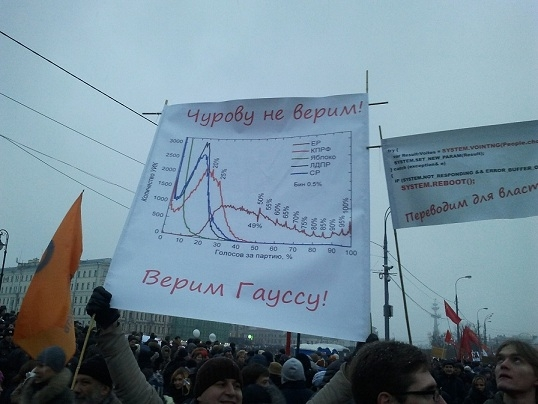

The poster says, 'We don't believe Churov! We believe Gauss!'  Churov is the head of the State Electoral Commissions and Gauss refers to a 18th century German mathematician, Carl Friedrich Gauss, whom the Gaussian (Normal) distribution was named after. Source: [http://darussophile.com/2011/12/measuring-churovs-beard/](http://darussophile.com/2011/12/measuring-churovs-beard/).

In this exercise, we use the rules of probability to detect election fraud by examining voting patterns in the 2011 Russian State Duma election. (The State Duma is the federal legislature of Russia.) This exercise is based on: 

Arturas Rozenas (2016). *Inferring Election Fraud from Distributions of Vote-Proportions.* Working Paper. 

The ruling political party, United Russia, won this election, but faced many accusations of election fraud, which the Russian government denied.  Some protesters highlighted irregular patterns of voting as evidence of election fraud, as shown in the Figure. In particular, protesters pointed out the relatively high frequency of common fractions such as $1/4$, $1/3$, and $1/2$ in the official vote shares.

We use official election results, contained in the `russia2011` data frame in 'fraud.RData' to investigate whether there is any evidence for election fraud.  This file can be loaded using the `load` function.  

In addition to `russia2011`, the file contains election results from the 2003 Russian Duma election `russia2003`, the 2012 Russian presidential election `russia2012`, and the 2011 Canadian election `canada2011` as separate data frames.  Each of these data sets has the same variables, described in the table below.


-------------------------------------------------------------------
 Name                Description
 ------------------- ----------------------------------------------
 `N`                 Total number of voters in a precinct 
 
 `turnout`           Total number of turnout in a precinct
 
 `votes`             Total number of votes for winner in a precinct
-------------------------------------------------------------------
 
## Question 1
 
To analyze the 2011 Russian election results, first compute United Russia's vote share as a proportion of the voters who turned out.  Identify the 10 most frequently occurring fractions for the vote share.  Create a histogram that sets the number of bins to the number of unique fractions, with one bar created for each uniquely observed fraction, to differentiate between similar fractions like $1/2$ and $51/100$. This can be done by using the `breaks` argument in the `hist` function.  What does this histogram look like at fractions with low numerators and denominators such as $1/2$ and $2/3$?

## Answer 1

```{r}
load("data/fraud.RData")
russia2011$rvote <- russia2011$votes / russia2011$turnout # vote share
sort(table(russia2011$rvote), decreasing = TRUE)[1:10]
```

Fractions with small numerators and denominators such as $1/2$, $1/3$,
and $2/3$ have high frequencies.  Note that `r 3/7` and
`r 4/7` represent $3/7$ and $4/7$ while `r 6/11` represents
$6/11$.  The histogram is shown below.

```{r}
par(cex = 1.5) 
hist(russia2011$rvote, freq = FALSE, ylim = c(0, 200),
     breaks = length(unique(russia2011$rvote)), 
     xlab = "United Russia's vote share", main = "")
```

## Question 2

The mere existence of high frequencies at low fractions may not imply election fraud.  Indeed, more numbers are divisible by smaller integers like 2, 3, and 4 than by larger integers like 22, 23, and 24.  To investigate the possibility that the low fractions arose by chance, assume the following probability model:

 * Turnout for a precinct is binomially distributed, with size equal to the number of voters in the precinct and success probability equal to its observed turnout rate.  
 * Vote counts for United Russia in a precinct is binomially distributed with size equal to the number of voters who simulated to turn out in the previous step and success probability equal to the precinct's observed vote share.  

Conduct a Monte Carlo simulation under these assumptions. 1000 simulated elections should be sufficient.  (Note that this may be computationally intensive code.  Write your code for a small number of simulations to test before running all 1000 simulations.)

What are the 10 most frequent vote share values?  

Create a histogram similar to the one in the previous question.  Briefly comment on the results.

## Answer 2

```{r}
sims <- 1000
n <- nrow(russia2011)

## observed turnout rate and vote share
russia2011$rturn <- russia2011$turnout / russia2011$N
russia2011$rvote <- russia2011$votes / russia2011$turnout

election <- function(){
  turnout <- rbinom(n, size = russia2011$N, prob = russia2011$rturn)
  rbinom(n, size = turnout, prob = russia2011$rvote) / turnout
}
# simulate 1000 elections and stack the results
voteshare <- replicate(sims, election())

# simple but slow method of getting 10 most frequent proportions
#
# sort(table(voteshare.vec), decreasing = TRUE)[1:10]

# more complex but faster way of getting 10 most frequent proportions
#
# sort and count 'runs' of the same vote share (~15s)
vs.rl <- rle(sort(as.vector(voteshare), decreasing = TRUE, method='quick'))
vs.rl.sorted <- vs.rl$values[order(vs.rl$lengths, decreasing = TRUE)] # sort

vs.rl.sorted[1:10] # most frequent 10 proportions

hist(as.vector(voteshare), breaks = 5000, freq = FALSE, main = "", xlab = "Vote Share")
```

Even when we assume the absence of election fraud, the relative frequency of small fractions such as 1/2, 1/3, and 2/3 is quite high. This pattern is similar to what we found in the observed data of the previous question.  This suggests that the high frequency of these fractions alone does not constitute evidence for election fraud.

## Question 3

To judge the Monte Carlo simulation results against the actual results of the 2011 Russian election, we compare the observed fraction of observations within a bin of certain size with its simulated counterpart.  To do this, create histograms showing the distribution of Question 2's four most frequently occurring fractions, i.e., $1/2$, $1/3$, $3/5$, and $2/3$, and compare them with the corresponding fractions' proportion in the actual election. Briefly interpret the results.

## Answer 3

```{r}
par(cex = 1.5) 
hist(apply(voteshare == 1/2, 2, mean), freq = FALSE, xlim = c(0, 0.005), 
     xlab = "Proportion", main = "Relative frequency of 1/2")
abline(v = mean(russia2011$rvote == 1/2), col = "red")
hist(apply(voteshare == 1/3, 2, mean), freq = FALSE, xlim = c(0, 0.005), 
     xlab = "Proportion", main = "Relative frequency of 1/3")
abline(v = mean(russia2011$rvote == 1/3), col = "red")
hist(apply(voteshare == 3/5, 2, mean), freq = FALSE, xlim = c(0, 0.005), 
     xlab = "Proportion", main = "Relative frequency of 3/5")
abline(v = mean(russia2011$rvote == 3/5), col = "red")
hist(apply(voteshare == 2/3, 2, mean), freq = FALSE, xlim = c(0, 0.005), 
     xlab = "Proportion", main = "Relative frequency of 2/3")
abline(v = mean(russia2011$rvote == 2/3), col = "red")
```

The observed relative frequency looks normal when compared to the simulated frequency under no election fraud for 1/2, 1/3, and 2/3. However, for 3/5, the observed frequency appears unusually high, suggesting irregularity in election returns.

## Question 4

We now compare the relative frequency of observed fractions with the simulated ones beyond the four fractions examined in the previous question.  To do this, we choose a bin size of 0.01 and compute the proportion of observations that fall into each bin.  We then examine whether or not the observed proportion falls within the 2.5 and 97.5 percentiles of the corresponding simulated proportions. Plot the result with vote share bin on the horizontal axis and estimated vote share on the vertical axis.  This plot attempts to reproduce the one held by protesters in the figure.  Now count the number of times an observed precinct vote share falls outside its simulated interval.  Interpret the results.

## Answer 4

```{r}
binsize <- 0.01
bins <- seq(from = 0, to = 0.99, by = binsize) 

bin_shares <- function(x){
  # count proportions of shares landing in (right open) intervals 
  hist(x, plot=FALSE, breaks = c(bins, 1), right = FALSE)$counts / n
}
# observed distribution of vote shares
prop.obs <- bin_shares(russia2011$rvote)

# distributions of simulated vote shares
prop.simul <- apply(voteshare, 2, bin_shares)

# compute 95% intervals for each bin proportion from the simulations
simul.int <- apply(prop.simul, 1, quantile, probs=c(0.025, 0.975))

plot(bins, prop.obs, ylim = c(0, 0.03), xlab = "Vote Share", ylab = "Density")
lines(bins, simul.int[1,]) # add 2.5% line
lines(bins, simul.int[2,]) # add 97.5% line

# number of times observed proportions are outside their interval
sum(prop.obs < simul.int[1,] | prop.obs > simul.int[2,])
```

We find that these bins observed proportions fall outside the range of simulated proportions. This suggests that election fraud may have indeed occurred.

## Question 5

To put the results of the previous question in perspective, apply the procedure developed in the previous question to the 2011 Canadian elections and the 2003 Russian election, where no major voting irregularities were reported.  In addition, apply this procedure to the 2012 Russian presidential election, where election fraud allegations were reported.  No plot needs to be produced. Briefly comment on the results you obtain.

Note: This question requires computationally intensive code. Write a code with a small number of simulations first and then run the final code with 1000 simulations.

## Answer 5

Since we repeat the same analysis using different data sets, we create
a function that implements the analysis. 

```{r}
fraud <- function(data){
  n <- nrow(data)
  data$rvote <- data$votes / data$turnout 
  data$rturn <- data$turnout / data$N

  election <- function(){
    turnout <- rbinom(n, size = data$N, prob = data$rturn)
    rbinom(n, size = turnout, prob = data$rvote) / turnout
  }
  voteshare <- replicate(sims, election())
  
  binsize <- 0.01
  bins <- seq(from = 0, to = 0.99, by = binsize) 
  bin_shares <- function(x){
    hist(x, plot=FALSE, breaks = c(bins, 1), right = FALSE)$counts / n
  }
  prop.simul <- apply(voteshare, 2, bin_shares) 
  prop.interval <- apply(prop.simul, 1, quantile, probs=c(0.025, 0.975))

  prop.obs <- bin_shares(data$rvote)
  
  sum(prop.obs < prop.interval[1,] | prop.obs > prop.interval[2,])
}

fraud(canada2011)
fraud(russia2003)
fraud(russia2012)
```

The results show that the number of times observed frequency exceeds the [2.5%, 97.5%] range of simulated frequency is higher for the 2011 and 2012 Russian elections than the 2011 Canadian and 2003 Russian elections.  This finding is consistent with the allegation of election fraud in the 2011 and 2012 Russian elections.
